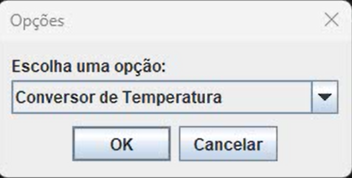

# Conversor

   
    

## Descrição do projeto

- O projeto Conversor é uma aplicação Java simples que tem como objetivo por em prática o que aprendemos durante a formação Backend Java da [ONE - Oracle Next Education](https://www.oracle.com/br/education/oracle-next-education/).
- Desenvolvido em Java e  com a Biblioteca Swing.
- Nele contém duas funcionalidades a de conversão de moedas e conversão de temperaturas.

## Imgem e Video

## Pré-requisitos do projeto:

### Conversor de moedas:
- Nesta oportunidade foi solicitado para nós Devs a criação de um conversor de moeda utilizando a linguagem Java. As características solicitadas por nosso cliente são as seguintes:

**O conversor de moeda deverá:**
- Converter de Reais a Dólar
- Converter de Reais a Euro
- Converter de Reais a Libras Esterlinas
- Converter de Reais a Peso argentino
- Converter de Reais a Peso Chileno

**Lembrando que deve ser possível também converter de forma inversa :**

- Como desafio extra incentivamos vocês a deixar fluir sua criatividade, se posso converter moedas, será que posso tal vez adicionar a meu programa outro tipo de conversões como temperatura por exemplo?

### Conversor de temperaturas:
- Como dito antes, foi proposto pela instituição que fizéssemos um projeto extra.
- O escolhido foi o conversor de temperaturas.

**O conversor de temperatura deverá:**
- Converter de Fahrenheit a Celsius
- Converter de Fahrenheit a Kelvin
- Converter de Celsius a Fahrenheit
- Converter de Celsius a Kelvin
- Converter de Kelvin a Fahrenheit
- Converter de Kelvin a Celsius

## Desenvolvedora 💻
  
  :octocat: [Jacqueline Casali](https://github.com/JacquelineCasali)

## Licença

  The [MIT License]() (MIT)  
  Copyright :copyright: 2023

  
